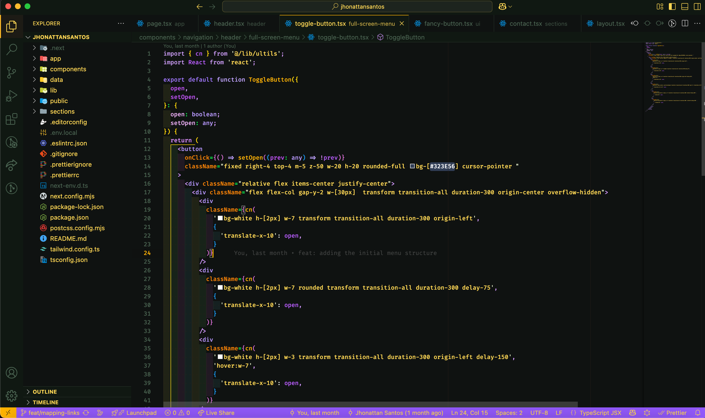
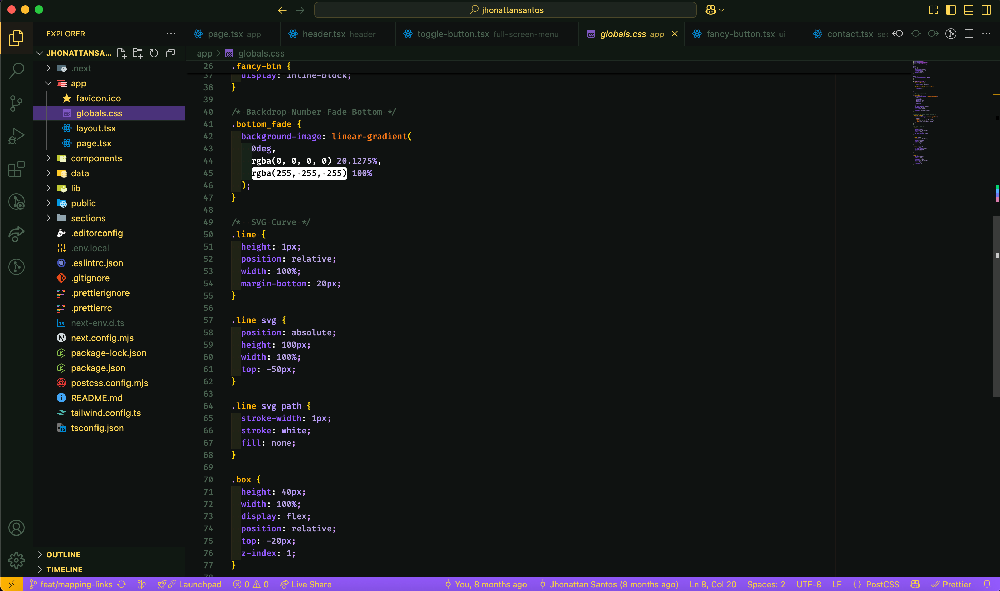

# Purple Orange

A **purple orange** theme to chill your eyes while coding in Visual Studio Code.





## Features

- Modern dark theme with purple and orange highlights
- Designed for comfortable, long coding sessions
- Supports syntax highlighting for most languages

## Installation

1. Open **Extensions** in VS Code (`Ctrl+Shift+X` or `Cmd+Shift+X` on Mac).
2. Search for **Purple Orange**.
3. Click **Install**.

Or install via command line:

```sh
code --install-extension Jhonattan-Santos.purple-orange
```

## Usage

1. Press `Ctrl+K Ctrl+T` (or `Cmd+K Cmd+T` on Mac) to open the theme picker.
2. Select **Purple Orange** from the list.

## Contributing

Feel free to open issues or pull requests to improve the theme.

## License

This theme is released under the [MIT License](LICENSE.md).
